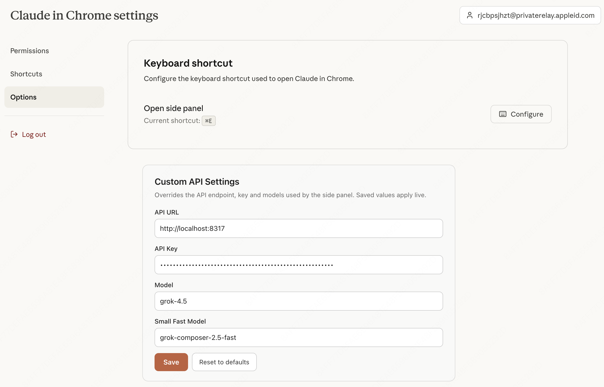

# Claude in Arc

A deep patching toolkit designed to inject Anthropic's Official Claude Chrome Extension natively into Arc Browser's visual structure.

Because Arc doesn't officially support Chrome's `chrome.sidePanel` APIs natively yet, this project intercepts the extension's unpacked local files and re-wires them to run as an injected iFrame, matching Arc's aesthetic perfectly.

## What's New in v0.3

- Added **Custom API Settings** — configure API URL, API Key, Model, and Small Fast Model on the extension Options page; values apply live to the side panel without reloading
- Added **View Mode** selection — switch between two sidepanel injection modes: Squeeze (Default) and Overlay (iFrame)
- Established connection with Claude Desktop via Native Messaging
- Bug fixes

### Custom API Settings

Open the extension **Options** page to set:

| Field | Description |
| --- | --- |
| API URL | Base URL of your API endpoint |
| API Key | Auth key for the endpoint |
| Model | Primary model name |
| Small Fast Model | Lightweight / fast model name |

Settings are stored in `chrome.storage.local` and synced into the side panel live.

## Installation

Download the ZIP from [Releases](https://github.com/cddchen/Claude-in-Arc/releases), or download the `1.0.66_0` folder directly from this repository and load it as an unpacked extension.

## Uninstallation

Go to `arc://extensions` and click **Remove Extension**.

---

# Claude in Arc（中文）

一套深度补丁工具，用于把 Anthropic 官方 Claude Chrome 扩展原生注入到 Arc 浏览器的视觉结构中。

由于 Arc 目前尚未原生支持 Chrome 的 `chrome.sidePanel` API，本项目会拦截扩展的本地解包文件，并将其改写为注入式 iFrame，以完美匹配 Arc 的视觉风格。

## v0.3 更新内容

- 新增 **自定义 API 设置** — 可在扩展 Options 页面配置 API URL、API Key、Model 与 Small Fast Model；保存后实时生效，无需重载扩展
- 新增 **View Mode 视图模式** — 可在两种侧边栏注入模式间切换：Squeeze（默认）与 Overlay（iFrame）
- 已通过 Native Messaging 与 Claude Desktop 建立连接
- 缺陷修复

### 自定义 API 设置

打开扩展的 **Options** 页面即可配置：

| 字段 | 说明 |
| --- | --- |
| API URL | API 接口的 Base URL |
| API Key | 接口鉴权 Key |
| Model | 主模型名称 |
| Small Fast Model | 轻量 / 快速模型名称 |

配置保存在 `chrome.storage.local` 中，并会实时同步到侧边栏。

## 安装

从 [Releases](https://github.com/cddchen/Claude-in-Arc/releases) 下载 ZIP，或直接下载本仓库中的 `1.0.66_0` 文件夹，然后以未打包扩展（Load unpacked）方式加载。

## 卸载

打开 `arc://extensions`，点击 **Remove Extension** 即可。
